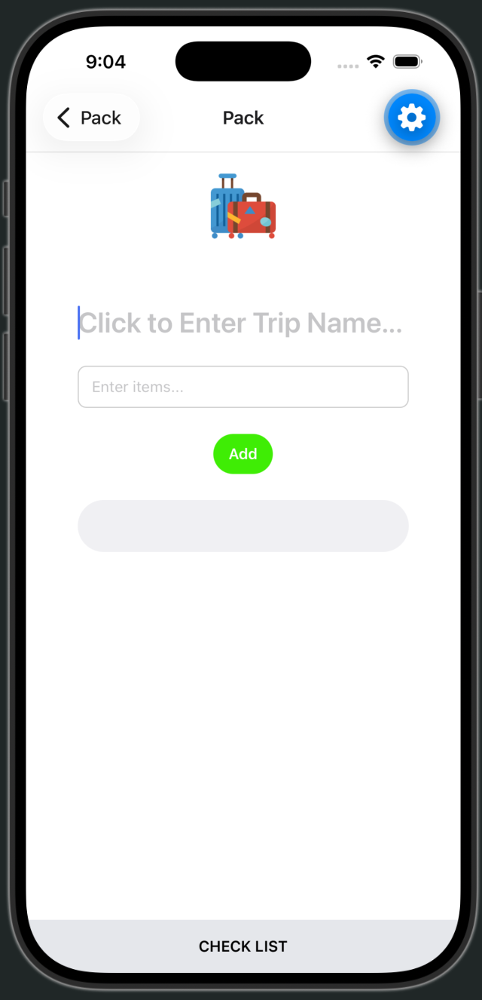
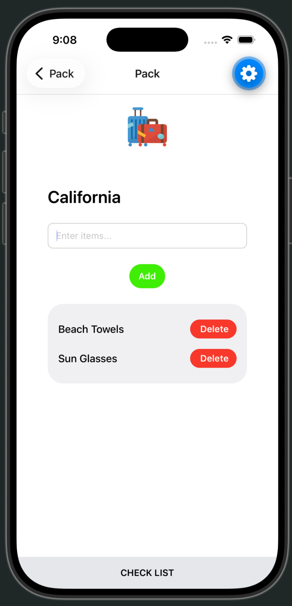
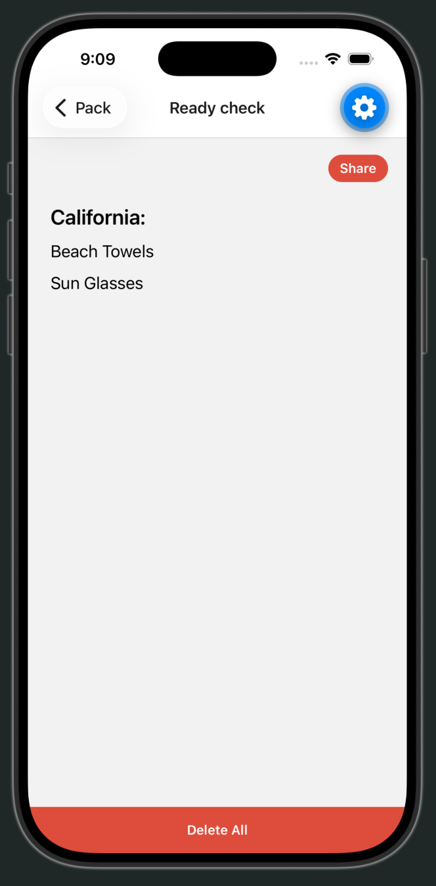
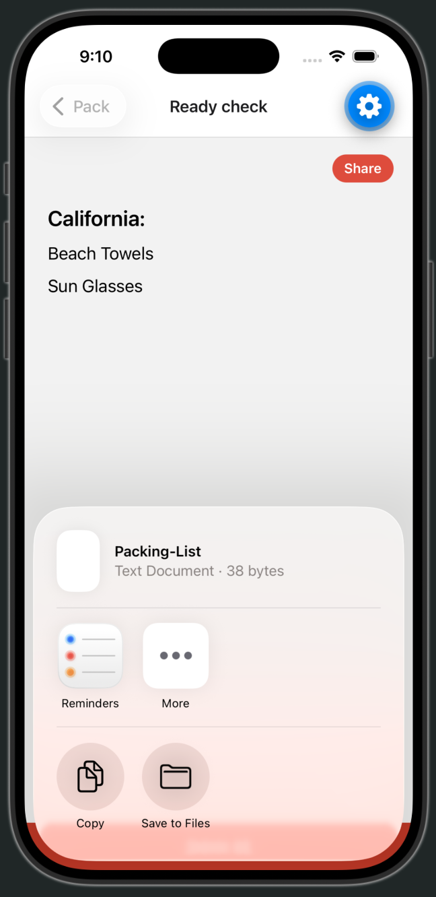
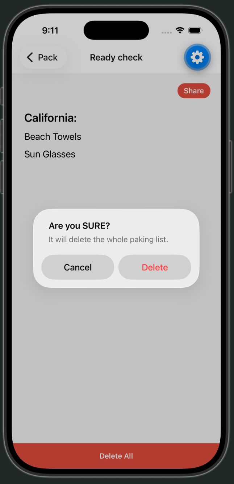
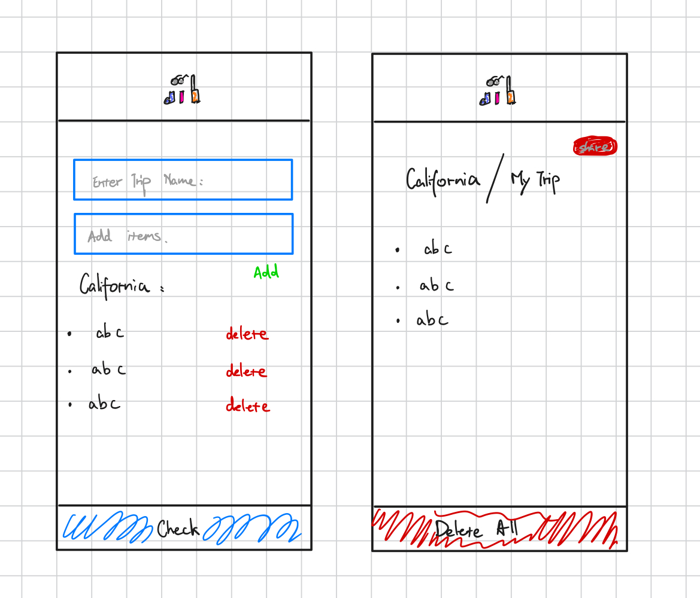

# Packing-List

## Prerequisites

To run this packing list app locally, you’ll need:

### 1. Node.js and npm

Node.js includes npm (the package manager).

- Download: [https://nodejs.org/](https://nodejs.org/) (LTS version recommended)
Note: for clone repository, check under line 67 'Installateion'.  
- Check install:

```bash
node -v
npm -v

* For update npm flobally: 
npm install npm@latest -g

```

### 2. Need Git

Needed to clone the repo.

Download: [https://git-scm.com/](https://git-scm.com/)
Check install:

```bash
`git --version` 
```

### 3. Expo (via this project)

You don’t need a global Expo install. After npm install, use:

```bash
npx expo start` 
```


### 4. A way to open the app (pick one)

- Option A — Phone (easiest)

Install Expo Go from the App Store (iOS) or Google Play (Android)
Scan the QR code from the terminal after npx expo start

- Option B — iOS Simulator (Mac only)

Install Xcode from the Mac App Store
Open Device Hub (Xcode 27+) or Simulator and boot an iPhone
Then press i in the Expo terminal

- Option C — Android Emulator

Install Android Studio
Set up an emulator, then press a in the Expo terminal

- Option D — Web

Press w in the Expo terminal after starting the project

## Installation

### 1. Clone the repo

```bash
git clone git@github.com:NoCinnamon/Packing-List.git
```


### 2. Install project package

```bash
npm install
```

Note: you dont need a global Expo install.

### 3. Start the app

```bash
npx expo start
```

Then open it with one of the options in Prerequisites section 4 (Expo Go, simulator, emulator, or web).

## Usage

This app can be used as a quick reminding list, espacially for trip packing.
Examples:

Home screen — enter a trip name and add items:

Adding items to the packing list:
 

 

Check list screen:
 

Share the list:
 

Delete All confirmation:
 

## App scetch:



## Extra expo packages:

1. expo-share
2. async-storage  @react-native-async-storage/async-storage 
3. Haptics

* expo-share: On second screen, the share button on the up right corner, when click, a sharing sheet pop at the bottom and the app writes the trip name and items into a text file.From there you can click copy then send the list through Messages, Mail, AirDrop, or another app on the phone.

* async-storage: it saves the data when you close the app, then when you reopen it, it shows the list from lastime you write it. Only when click **delete All** button, it will delete all, and back to begining empty stage.

* Haptics: make the device vibrate when click **Delete ALL** button.
